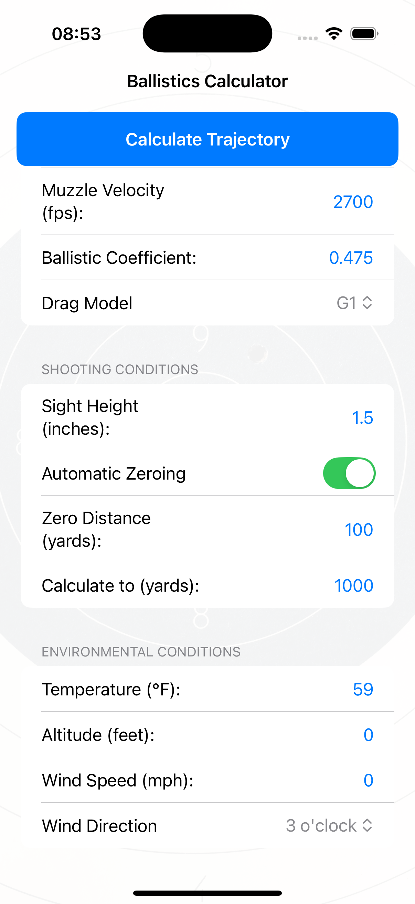

# Ballistics Engine

A high-performance ballistics trajectory calculation engine with comprehensive physics modeling, automatic zeroing, and statistical analysis capabilities.

**Project Website:** [https://ballistics.rs/](https://ballistics.rs/)

## Features

- **Full 3D Trajectory Integration** - Six-state ballistic modeling with RK4 and Euler integration methods
- **Advanced Drag Models** - Support for G1, G7, and custom drag curves with automatic transonic corrections
- **Automatic Zeroing** - Calculate sight adjustments and apply zero angles automatically
- **Unit Conversion** - Seamless switching between Imperial (default) and Metric units
- **BC Segmentation** - Velocity-dependent ballistic coefficient modeling with automatic estimation
- **Atmospheric Modeling** - Temperature, pressure, humidity, and altitude effects with ICAO standard atmosphere
- **Wind Effects** - 3D wind calculations with altitude-dependent wind shear modeling
- **Monte Carlo Simulations** - Statistical analysis with parameter uncertainties
- **BC Estimation** - Estimate ballistic coefficients from trajectory data
- **Advanced Physics**:
  - **Spin Effects**: Magnus effect, enhanced spin drift with decay modeling
  - **Earth Effects**: Coriolis effect with latitude-dependent calculations
  - **Angular Motion**: Gyroscopic precession and nutation physics
  - **Transonic Analysis**: Pitch damping coefficients and stability warnings
  - **Trajectory Sampling**: Regular interval data collection for analysis
  - **Form Factor Corrections**: Bullet-specific drag adjustments
- **Multiple Output Formats** - JSON, CSV, and formatted tables

## Installation

### From Source

```bash
git clone https://github.com/ajokela/ballistics-engine.git
cd ballistics-engine
cargo build --release
```

The binary will be at: `target/release/ballistics`

## Quick Start

### Basic Trajectory (Imperial Units - Default)

```bash
# .308 Winchester, 168gr bullet at 2700 fps
./ballistics trajectory -v 2700 -b 0.475 -m 168 -d 0.308 --max-range 1000

# With automatic zeroing at 200 yards
./ballistics trajectory -v 2700 -b 0.475 -m 168 -d 0.308 --auto-zero 200 --max-range 500
```

### Metric Units

```bash
# Same bullet in metric units
./ballistics trajectory --units metric -v 823 -b 0.475 -m 10.9 -d 7.82 --max-range 1000
```

## Unit Systems

The engine supports two unit systems, selectable with the `--units` flag:

### Imperial (Default)
- **Velocity**: feet per second (fps)
- **Mass**: grains
- **Distance**: yards
- **Diameter**: inches
- **Temperature**: Fahrenheit
- **Pressure**: inHg
- **Wind**: mph

### Metric
- **Velocity**: meters per second (m/s)
- **Mass**: grams
- **Distance**: meters
- **Diameter**: millimeters
- **Temperature**: Celsius
- **Pressure**: hPa (millibars)
- **Wind**: m/s

## Commands

### Trajectory Calculation

Calculate ballistic trajectory with environmental conditions:

```bash
# Imperial units (default)
./ballistics trajectory \
  -v 2700          # Velocity (fps)
  -b 0.475         # Ballistic coefficient
  -m 168           # Mass (grains)
  -d 0.308         # Diameter (inches)
  --drag-model g7  # G7 drag model
  --angle 0        # Launch angle (degrees)
  --max-range 1000 # Maximum range (yards)
  --wind-speed 10  # Wind speed (mph)
  --wind-direction 90  # Wind from right (degrees)
  --temperature 59     # Temperature (Fahrenheit)
  --pressure 29.92    # Pressure (inHg)
  --humidity 50       # Relative humidity (%)
  --altitude 0        # Altitude (feet)
  --full             # Show all trajectory points
```

#### Auto-Zero Feature

Automatically calculate and apply the zero angle for a specific distance:

```bash
# Zero at 200 yards and show trajectory to 500 yards
./ballistics trajectory \
  -v 2700 -b 0.475 -m 168 -d 0.308 \
  --auto-zero 200 \  # Automatically zero at 200 yards
  --max-range 500 \
  --full

# Custom sight height for auto-zero
./ballistics trajectory \
  -v 2700 -b 0.475 -m 168 -d 0.308 \
  --auto-zero 100 \
  --sight-height 0.055  # 2.2 inches in yards
```

#### Advanced BC Modeling

Enable velocity-dependent BC modeling for more accurate long-range predictions:

```bash
# Enable BC segmentation (velocity-based BC changes)
./ballistics trajectory \
  -v 2700 -b 0.475 -m 168 -d 0.308 \
  --use-bc-segments \
  --auto-zero 600 \
  --max-range 1000
```

#### Advanced Physics - Magnus and Spin Drift

Enable advanced gyroscopic and aerodynamic effects:

```bash
# Magnus effect and spin drift calculation
./ballistics trajectory \
  -v 2700 -b 0.475 -m 168 -d 0.308 \
  --twist-rate 10      # 1:10" barrel twist
  --twist-right        # Right-hand twist
  --enable-magnus      # Enable Magnus effect
  --enable-spin-drift  # Enable enhanced spin drift
  --wind-speed 10 \
  --wind-direction 90 \
  --max-range 1000

# Coriolis effect for extreme long range
./ballistics trajectory \
  -v 3000 -b 0.750 -m 250 -d 0.338 \
  --enable-coriolis \
  --latitude 45        # Shooting latitude
  --shooting-angle 90  # Azimuth (0=N, 90=E)
  --max-range 2000
```

### Zero Calculation

Calculate the sight adjustment needed to zero at a specific distance:

```bash
# Calculate zero for 200 yards
./ballistics zero \
  -v 2700 -b 0.475 -m 168 -d 0.308 \
  --target-distance 200

# With custom sight height (default is 0.05 yards / 1.8 inches)
./ballistics zero \
  -v 2700 -b 0.475 -m 168 -d 0.308 \
  --target-distance 300 \
  --sight-height 0.055  # 2.2 inches

# Metric example
./ballistics zero --units metric \
  -v 823 -b 0.475 -m 10.9 -d 7.82 \
  --target-distance 200  # 200 meters
```

Output includes:
- Zero angle in degrees
- Adjustment in MOA (Minutes of Angle)
- Adjustment in mrad (milliradians)
- Maximum ordinate (highest point of trajectory)

### Monte Carlo Simulation

Run statistical analysis with parameter variations:

```bash
./ballistics monte-carlo \
  -v 2700         # Base velocity (fps)
  -b 0.475        # Base BC
  -m 168          # Mass (grains)
  -d 0.308        # Diameter (inches)
  -n 1000         # Number of simulations
  --velocity-std 10    # Velocity std dev (fps)
  --angle-std 0.5     # Angle std dev (degrees)
  --bc-std 0.01       # BC std dev
  --wind-std 2        # Wind speed std dev (mph)
  --target-distance 300  # Target distance for hit probability
```

### BC Estimation

Estimate ballistic coefficient from observed trajectory data:

```bash
./ballistics estimate-bc \
  -v 2700 -m 168 -d 0.308 \
  --distance1 100 --drop1 0.0   # First data point
  --distance2 200 --drop2 0.023  # Second data point
```

## Advanced Features

### Integration Methods

The engine supports two numerical integration methods:

- **RK4 (Runge-Kutta 4th Order)** - Default method, provides superior accuracy
- **Euler Method** - Available with `--use-euler` flag for faster computation

### Wind Shear Modeling

Model altitude-dependent wind variations:

```bash
./ballistics trajectory -v 2700 -b 0.475 -m 168 -d 0.308 \
  --wind-speed 10 --wind-direction 90 \
  --enable-wind-shear \
  --max-range 1000
```

### Transonic Stability Analysis

Analyze projectile stability through the transonic regime:

```bash
./ballistics trajectory -v 3000 -b 0.475 -m 168 -d 0.308 \
  --enable-pitch-damping \
  --max-range 2000
```

Provides warnings about transonic instability and minimum pitch damping coefficients.

### Trajectory Sampling

Collect trajectory data at regular intervals for detailed analysis:

```bash
./ballistics trajectory -v 2700 -b 0.475 -m 168 -d 0.308 \
  --sample-trajectory \
  --sample-interval 25  # Sample every 25 yards
  --max-range 1000 -o json
```

### Angular Motion Physics

Model precession and nutation of spinning projectiles:

```bash
./ballistics trajectory -v 2700 -b 0.475 -m 168 -d 0.308 \
  --twist-rate 10 \
  --enable-precession \
  --max-range 1000
```

### Complete Advanced Physics Example

```bash
./ballistics trajectory \
  -v 2850 -b 0.690 -m 230 -d 0.338 \
  --drag-model g7 \
  --twist-rate 8.5 --twist-right \
  --enable-magnus \
  --enable-coriolis \
  --enable-spin-drift \
  --enable-wind-shear \
  --enable-pitch-damping \
  --enable-precession \
  --sample-trajectory \
  --latitude 38.5 \
  --shooting-angle 45 \
  --wind-speed 15 --wind-direction 270 \
  --altitude 6000 \
  --max-range 2000
```

## Physics Modeling

The ballistics engine implements comprehensive physics modeling for accurate trajectory prediction:

### Aerodynamic Effects
- **Drag Modeling** - Multiple drag functions (G1-G8, JBM, custom curves) with transonic flow corrections
- **Form Factor** - Projectile efficiency corrections based on shape and design
- **Reynolds Number Effects** - Viscosity and flow regime corrections

### Gyroscopic Effects  
- **Spin Drift** - Lateral deviation due to gyroscopic and Magnus effects
- **Precession** - Gyroscopic precession of spinning projectile
- **Nutation** - Oscillatory motion superimposed on precession
- **Spin Decay** - Reduction in spin rate over time due to aerodynamic damping
- **Pitch Damping** - Aerodynamic moments opposing angular motion

### Environmental Effects
- **Coriolis Effect** - Earth's rotation influence on long-range trajectories
- **Magnus Effect** - Force from spinning projectile in crossflow
- **Wind Shear** - Altitude-dependent wind variations
- **Atmospheric Stratification** - Density and sound speed variations with altitude

### Stability Modeling
- **Dynamic Stability** - Gyroscopic and aerodynamic stability calculations
- **Yaw of Repose** - Equilibrium yaw angle in crosswind
- **Limit Cycle Yaw** - Bounded oscillatory motion analysis

## FFI Layer

The library includes a Foreign Function Interface (FFI) layer for integration with iOS, Android, and other platforms. The FFI provides C-compatible bindings for all major functionality.



### FFI Features
- **C-Compatible Structures** - All data structures use C-compatible layouts
- **Safe Memory Management** - Proper handling of memory across language boundaries
- **iOS/Swift Integration** - Ready for use with Swift through bridging headers
- **Android/JNI Support** - Compatible with Java Native Interface
- **Monte Carlo Simulation** - Statistical analysis with parameter variations
- **Error Handling** - Graceful error propagation across FFI boundary

### Example FFI Usage (C/Swift)
```c
// Create input parameters
FFIBallisticInputs inputs = {
    .muzzle_velocity = 823.0,        // m/s
    .ballistic_coefficient = 0.475,
    .mass = 0.0109,                  // kg
    .diameter = 0.00782,             // meters
    .drag_model = 0,                 // G1
    .sight_height = 0.05,            // meters
    .temperature = 15.0,             // Celsius
    .altitude = 0.0
};

// Calculate trajectory
FFITrajectoryResult* result = ballistics_calculate_trajectory(&inputs, NULL, NULL, 1000.0, 0.1);

// Use results
printf("Max range: %.2f meters\n", result->max_range);

// Clean up
ballistics_free_trajectory_result(result);
```

### Monte Carlo Simulation via FFI
```c
// Set up Monte Carlo parameters
FFIMonteCarloParams params = {
    .num_simulations = 1000,
    .velocity_std_dev = 10.0,       // m/s variation
    .angle_std_dev = 0.001,         // radian variation (elevation)
    .bc_std_dev = 0.01,             // BC variation
    .wind_speed_std_dev = 2.0,      // m/s wind variation
    .target_distance = 600.0,       // Target at 600m
    .azimuth_std_dev = 0.001        // radian variation (horizontal)
};

// Run simulation
FFIMonteCarloResults* results = ballistics_monte_carlo(&inputs, NULL, &params);

// Use statistical results
printf("Mean range: %.2f m (σ=%.2f)\n", results->mean_range, results->std_dev_range);
printf("Hit probability at 600m: %.1f%%\n", results->hit_probability * 100);

// Access individual shots
for (int i = 0; i < results->num_results; i++) {
    printf("Shot %d: Range %.2f m, Impact velocity %.2f m/s\n", 
           i, results->ranges[i], results->impact_velocities[i]);
}

// Clean up
ballistics_free_monte_carlo_results(results);
```

## Output Formats

All commands support three output formats via the `-o` flag:

- **table** (default) - Formatted ASCII table for terminal display
- **json** - Complete data in JSON format for programmatic use
- **csv** - Comma-separated values for spreadsheet analysis

## Practical Examples

### Hunting Zero

Zero a hunting rifle at 200 yards with environmental conditions:

```bash
# Calculate zero angle
./ballistics zero \
  -v 2650 -b 0.460 -m 180 -d 0.308 \
  --target-distance 200

# Verify trajectory with auto-zero
./ballistics trajectory \
  -v 2650 -b 0.460 -m 180 -d 0.308 \
  --auto-zero 200 \
  --max-range 400 \
  --wind-speed 15 \
  --wind-direction 270 \
  --temperature 32 \
  --humidity 30 \
  --altitude 5000 \
  --full
```

### Long Range Shooting

Analyze trajectory for 1000-yard shot:

```bash
./ballistics trajectory \
  -v 2850 -b 0.690 -m 230 -d 0.338 \
  --drag-model g7 \
  --auto-zero 100 \
  --max-range 1100 \
  --wind-speed 10 \
  --wind-direction 45 \
  --full \
  -o json > trajectory.json
```

### Load Development

Compare different loads using Monte Carlo:

```bash
# Load 1: Higher velocity, more variation
./ballistics monte-carlo \
  -v 2750 -b 0.475 -m 168 -d 0.308 \
  -n 1000 \
  --velocity-std 15 \
  --target-distance 600

# Load 2: Lower velocity, more consistent
./ballistics monte-carlo \
  -v 2680 -b 0.475 -m 168 -d 0.308 \
  -n 1000 \
  --velocity-std 8 \
  --target-distance 600
```

## Advanced Features

### BC Segmentation

Velocity-dependent BC modeling accounts for how ballistic coefficient changes as the bullet slows down. Enable with `--use-bc-segments`:

- Automatically estimates BC segments based on bullet characteristics
- No external data required - uses caliber, weight, and BC
- Identifies bullet type (Match, Hunting, VLD, etc.) from parameters
- Applies physics-based BC degradation curves

Example:
```bash
./ballistics trajectory -v 2700 -b 0.475 -m 168 -d 0.308 --use-bc-segments --max-range 1000
```


### Advanced Physics Modeling

When enabled, the engine calculates:
- **Magnus Effect** - Side force from spinning projectiles
- **Spin Drift** - Lateral drift due to gyroscopic effects
- **Coriolis Effect** - Earth rotation effects (with latitude input)
- **Transonic Drag** - Enhanced drag modeling in transonic regime
- **Reynolds Number Corrections** - Viscous effects at low velocities

## Building from Source

### Requirements

- Rust 1.70 or later
- Cargo build system

### Build Commands

```bash
# Debug build
cargo build

# Release build (optimized)
cargo build --release

# Run tests
cargo test

# Build documentation
cargo doc --open
```

## Library Usage

Use as a Rust library in your own projects:

```rust
use ballistics_engine::{
    BallisticInputs, TrajectorySolver, 
    WindConditions, AtmosphericConditions
};

fn main() -> Result<(), Box<dyn std::error::Error>> {
    let inputs = BallisticInputs {
        muzzle_velocity: 823.0,  // m/s
        launch_angle: 0.0,       // radians
        ballistic_coefficient: 0.475,
        mass: 0.0109,            // kg
        diameter: 0.00782,       // meters
        sight_height: 0.05,      // meters
        ..Default::default()
    };
    
    let wind = WindConditions {
        speed: 5.0,              // m/s
        direction: 1.5708,       // 90 degrees in radians
        ..Default::default()
    };
    
    let atmosphere = AtmosphericConditions {
        temperature: 15.0,       // Celsius
        pressure: 1013.25,       // hPa
        humidity: 50.0,          // %
        altitude: 0.0,           // meters
        ..Default::default()
    };
    
    let solver = TrajectorySolver::new(inputs, wind, atmosphere);
    let result = solver.solve()?;
    
    println!("Max range: {:.2} m", result.max_range);
    println!("Max height: {:.2} m", result.max_height);
    println!("Time of flight: {:.3} s", result.time_of_flight);
    
    Ok(())
}
```

## Performance

Optimized Rust implementation provides:
- Single trajectory (1000m): ~5ms
- Monte Carlo (1000 runs): ~500ms  
- BC estimation: ~50ms
- Zero calculation: ~10ms

## Common Ballistic Coefficients

| Caliber | Weight | BC (G1) | BC (G7) | Description |
|---------|--------|---------|---------|-------------|
| .223    | 55gr   | 0.250   | -       | FMJ |
| .223    | 77gr   | 0.362   | 0.182   | Match |
| .308    | 168gr  | 0.475   | 0.224   | Match |
| .308    | 175gr  | 0.505   | 0.253   | Match |
| .308    | 180gr  | 0.480   | -       | Hunting |
| .338    | 300gr  | 0.768   | 0.383   | Match |
| 6.5mm   | 140gr  | 0.620   | 0.310   | Match |
| .50     | 750gr  | 1.050   | 0.520   | Match |

## Troubleshooting

### Trajectory hits ground early
- Check if you're using `--auto-zero` or setting `--angle` manually
- Default angle is 0° (horizontal), which will hit ground quickly
- Use `--auto-zero <distance>` to automatically calculate proper angle

### Units confusion
- Default is Imperial (fps, grains, yards)
- Use `--units metric` for metric system
- All inputs must match the selected unit system

### Unexpected BC behavior
- G1 and G7 models have different BC values for same bullet
- G7 typically better for boat-tail bullets
- BC segmentation automatically applied based on bullet type

## Contributing

Contributions are welcome! Please:
1. Fork the repository
2. Create a feature branch
3. Add tests for new features
4. Run `cargo test` and `cargo fmt`
5. Submit a pull request

## License

This project is licensed under the MIT License - see LICENSE file for details.

## Acknowledgments

- Ballistics physics based on Robert McCoy's "Modern Exterior Ballistics"
- Drag tables from military ballistics research
- BC segmentation algorithms from Bryan Litz's research
- Community contributions and testing

## Support

For issues, questions, or contributions:
- GitHub Issues: [github.com/ajokela/ballistics-engine/issues](https://github.com/ajokela/ballistics-engine/issues)